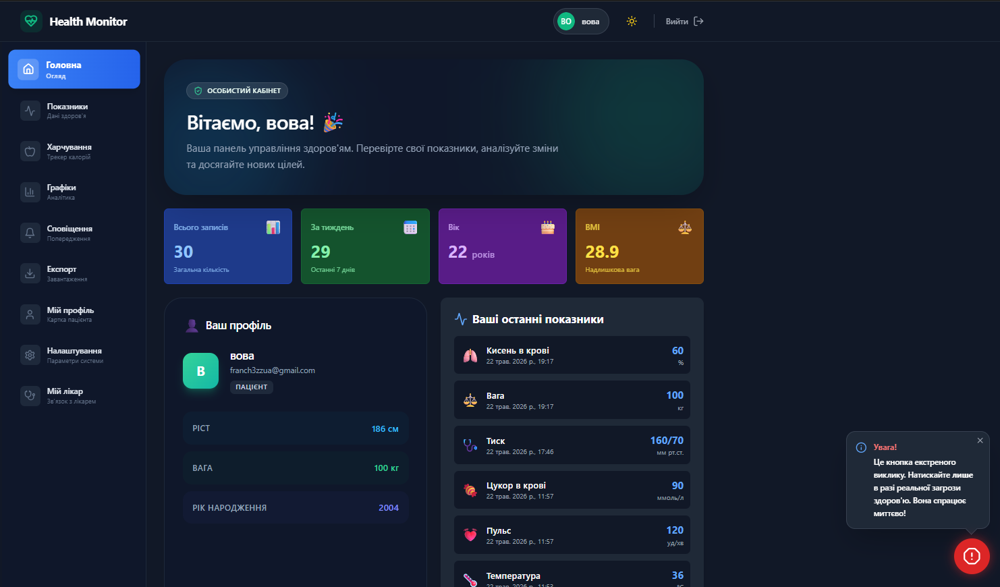
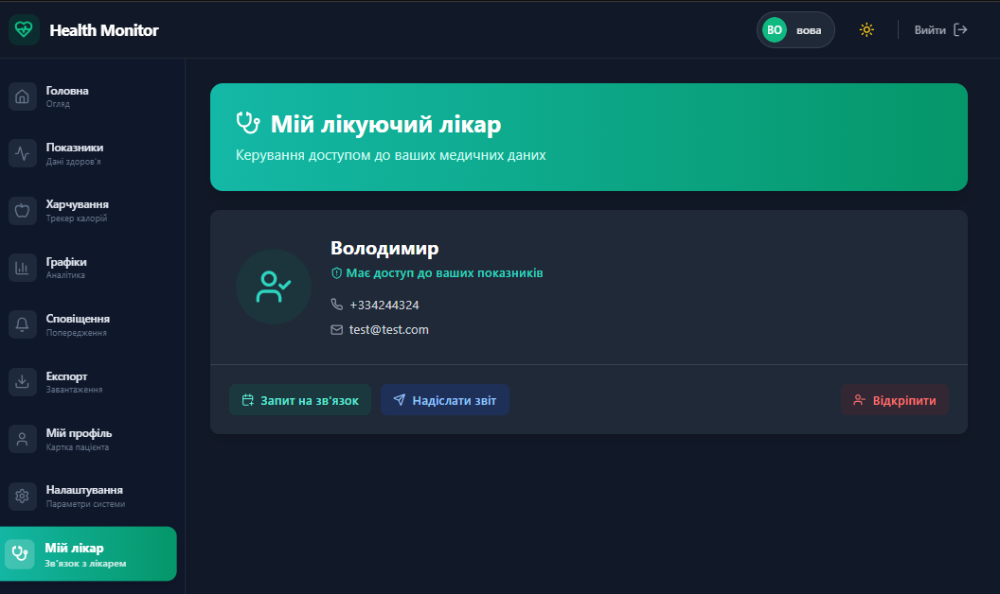
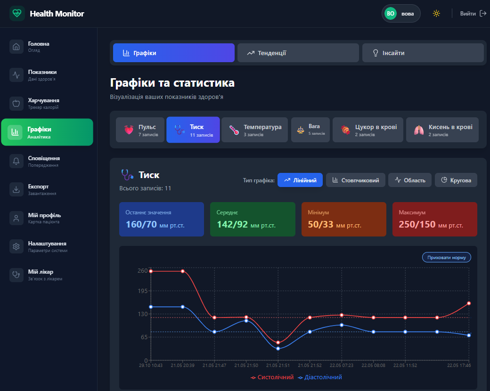
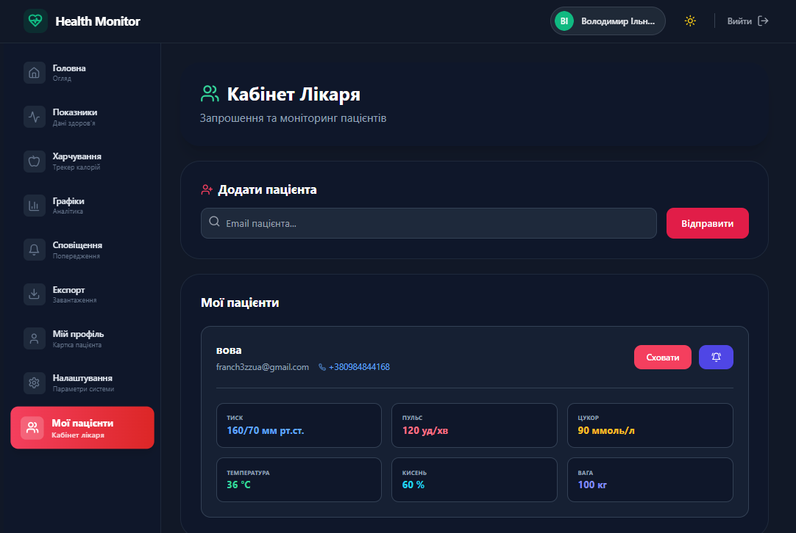
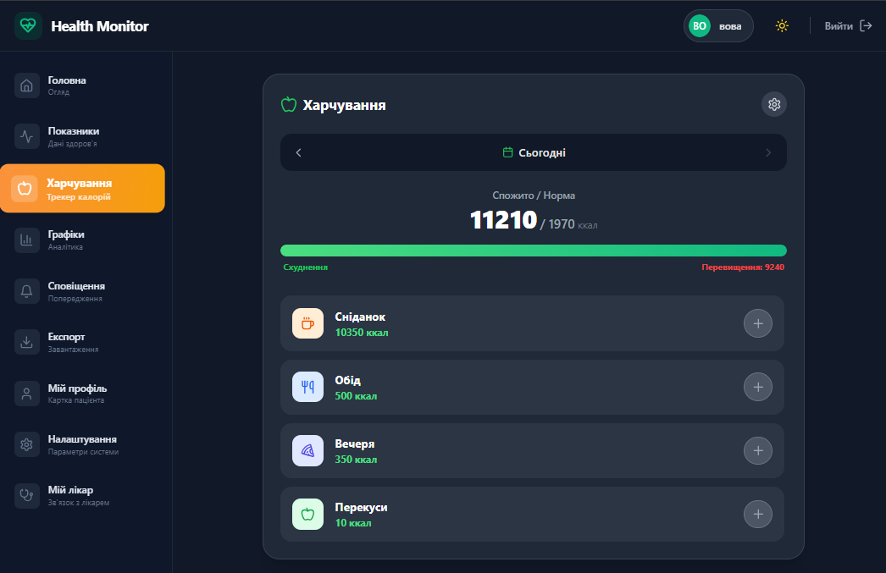

# 📘 Health Monitor

> *Сучасна вебсистема для моніторингу показників здоров'я з розділенням ролей, хмарним збереженням даних та інтеграцією з Telegram.*

---

## 👤 Автор

- **ПІБ:** Ільницький Володимир
- **Група:** ФЕС - 41
- **Керівник:** Вельгош Сергій Романович
- **Дата виконання:** 22.05.2026

---

## 📌 Загальна інформація

- **Тип проєкту:** Вебзастосунок (Single Page Application)
- **Мова програмування:** JavaScript / JSX
- **Фреймворки / Бібліотеки:**
  - React
  - Tailwind CSS
  - Lucide React
  - React Hot Toast
- **Backend та база даних:**
  - Firebase Authentication
  - Firebase Firestore

---

## 🧠 Опис функціоналу

### 🔐 Рольова модель
Реєстрація та авторизація користувачів із розподілом ролей:

- Пацієнт
- Лікар

### 🩺 Трекінг здоров'я

Можливість зберігати:

- Артеріальний тиск
- Пульс
- Рівень цукру
- Температуру
- SpO₂
- Вагу

### 🍏 Віджет харчування

Функціонал:

- Підрахунок калорій
- Індивідуальна добова норма
- Формула Міффліна–Сан Жеора
- Цілі:
  - Схуднення
  - Підтримка ваги
  - Набір маси

### 👨‍⚕️ Кабінет лікаря

- Пошук пацієнтів
- Надсилання запитів доступу
- Перегляд показників у реальному часі
- Контроль підключених пацієнтів

### 📱 Telegram інтеграція

Бот:

```
@health_monitors_bot
```

Можливості:

- Критичні сповіщення
- Нагадування від лікаря
- Миттєві повідомлення

### 🛡️ Приватність

Пацієнт може:

- Відкрити доступ до даних
- Закрити доступ до даних
- Контролювати перегляд показників

### 🌓 Інтерфейс

- Glassmorphism дизайн
- Світла тема
- Темна тема

---

## 🧱 Основні компоненти

| Файл                  | Призначення                             |
|-----------------------|-----------------------------------------|
| `App.jsx`             | Ініціалізація застосунку та провайдерів |
| `Dashboard.jsx`       | Головна панель користувача              |
| `NutritionWidget.jsx` | Контроль харчування                     |
| `PatientsList.jsx`    | Панель лікаря                           |
| `ProfileSettings.jsx` | Налаштування профілю                    |
| `firebase.js`         | Firebase конфігурація                   |

---

# ▶️ Запуск проєкту

## 1. Встановлення інструментів

Необхідно встановити:

- Node.js (v18+)
- Google Firebase

У Firebase потрібно активувати:

- Authentication
- Firestore Database

---

## 2. Клонування репозиторію

```bash
git clone https://github.com/vol-iln/health-monitor.git

cd health-monitor
```

---

## 3. Встановлення залежностей

```bash
npm install
```

---

## 4. Налаштування Firebase

Створіть файл:

```bash
.env
```

Додайте:

```env
VITE_FIREBASE_API_KEY=your_api_key
VITE_FIREBASE_AUTH_DOMAIN=your_project.firebaseapp.com
VITE_FIREBASE_PROJECT_ID=your_project_id
VITE_FIREBASE_STORAGE_BUCKET=your_project.appspot.com
VITE_FIREBASE_MESSAGING_SENDER_ID=your_sender_id
VITE_FIREBASE_APP_ID=your_app_id
```

---

## 5. Запуск застосунку

```bash
npm run dev
```

Відкрийте:

```text
http://localhost:3000
```

---

# 🔌 Структура Firebase Firestore

## 👥 Колекція `users`

```json
{
  "name": "Іван Іванов",
  "email": "ivan@example.com",
  "role": "user",
  "height": 180,
  "weight": 75,
  "birthYear": 1995,
  "shareWithDoctors": true,
  "telegramId": "123456789",
  "doctorId": "uid_лікаря"
}
```

---

## 🩺 Колекція `healthData`

```json
{
  "userId": "uid_пацієнта",
  "type": "pressure",
  "systolic": 120,
  "diastolic": 80,
  "date": "2026-05-22T10:00:00Z"
}
```

---

# 🖱️ Інструкція користувача

## Для пацієнта

1. Зареєструвати акаунт
2. Обрати роль "Пацієнт"
3. Додати антропометричні дані
4. Додавати показники здоров'я
5. Підключити Telegram
6. Налаштувати приватність

---

## Для лікаря

1. Зареєструвати акаунт
2. Обрати роль "Лікар"
3. Перейти у "Мої пацієнти"
4. Знайти пацієнта через email
5. Надіслати запит доступу
6. Переглядати актуальні показники

---

# 🧪 Типові проблеми

|  Проблема                         |  Рішення                      |
|-----------------------------------|-------------------------------|
| `auth/invalid-credential`         | Перевірити email та пароль    |
| Дані пацієнта не відображаються   | Перевірити `shareWithDoctors` |
| Telegram не надсилає повідомлення | Запустити `/start` у боті     |

---

# 🛠️ Технології

- React
- Firebase
- Tailwind CSS
- Vite
- Lucide React
- React Hot Toast
- Telegram Bot API

---

# 🧾 Використані джерела

1. React Documentation — https://react.dev/
2. Firebase Documentation — https://firebase.google.com/docs
3. Tailwind CSS Documentation — https://tailwindcss.com/
4. Lucide Icons — https://lucide.dev/

---

## 📷 Скриншоти

Огляд інтерфейсу та основного функціоналу застосунку:

**Головна панель (Особистий кабінет пацієнта)**
*Огляд антропометричних даних, швидкі дії та сучасний візуальний стиль системи.*


**Кабінет лікаря (Моніторинг пацієнтів)**
*Інтерфейс лікаря для пошуку прикріплених пацієнтів та безпечного перегляду їхніх актуальних показників.*


**Аналітика та графіки**
*Візуалізація динаміки показників здоров'я (тиск, пульс, вага тощо) для детального аналізу змін.*


**Мій лікар**
*Сторінка пацієнта для перегляду інформації про свого лікаря та керування доступом.*


**Віджет харчування**
*Преміальний інтерфейс щоденника калорій з розрахунком добової норми та контролем раціону.*



---


## ⭐ Основна ідея проєкту

**Health Monitor** — це сучасна система моніторингу здоров'я, яка дозволяє пацієнтам контролювати свої показники, а лікарям — віддалено спостерігати за станом пацієнтів через безпечний вебінтерфейс та Telegram-сповіщення.